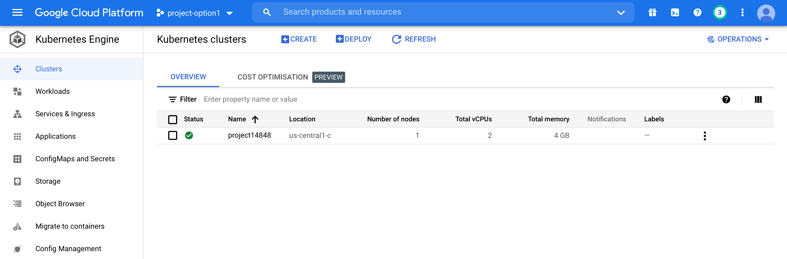
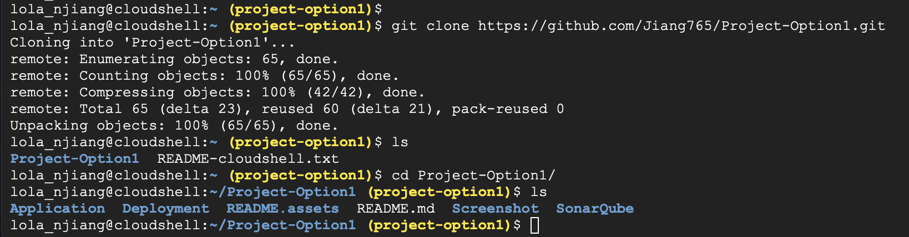
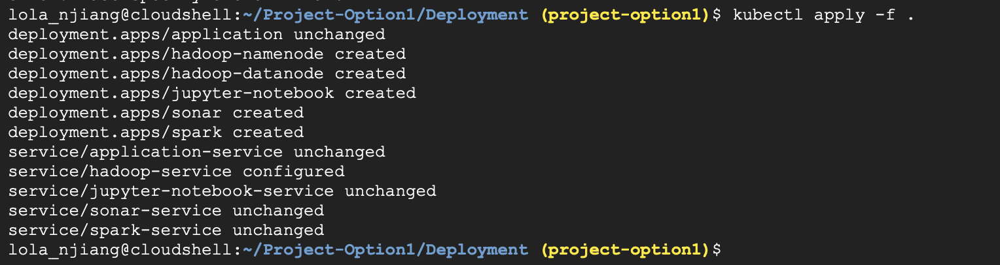
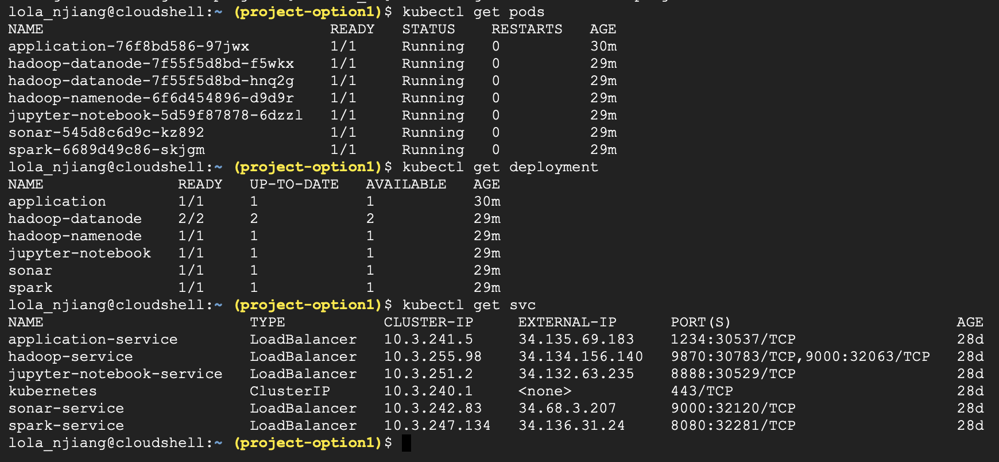
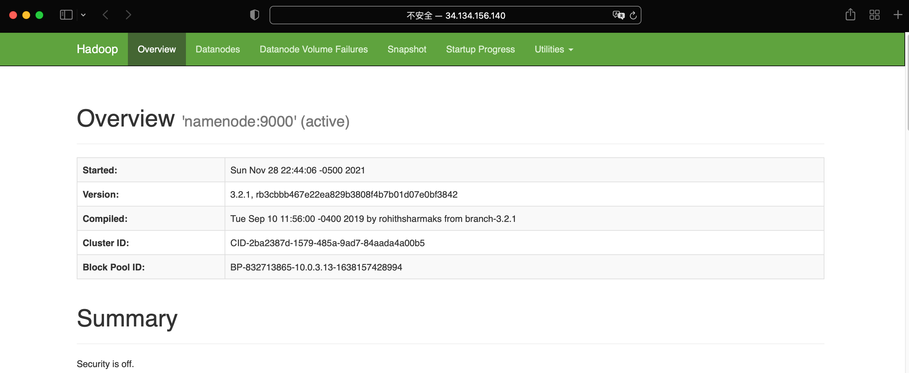
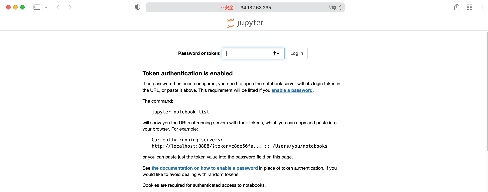
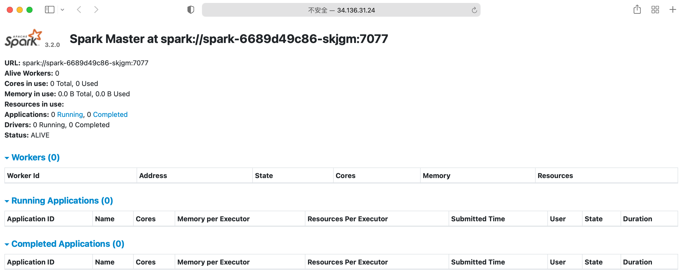
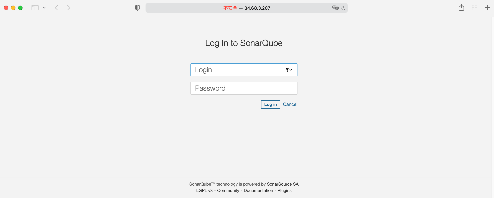

# Project_Option1

## Steps

### Deployment

Step 1: Create a new project and set up a kubernetes cluster in GKE.

My project name and project ID is  `project-option1`.

Open Cloud Shell, run the following commands:

`gcloud config set project project-option1`

`gcloud container clusters create project14848 --num-nodes=4 --zone=us-central1-c`



Step 2: GCP authentication: Fetch cluster endpoint and auth data. Generate Kubeconfig entry.

`gcloud container clusters get-credentials project14848 --zone us-central1-c`

Step 3: Deploy the services.

a. Download the files from this GitHub repo.



b. Execute the following command to set up different services.

Relevent configuration files (.yaml) are in the Deployment folder.

```bash
cd Project-Option1/Deployment

kubectl apply -f deployment-application.yaml
kubectl apply -f service-application.yaml

kubectl apply -f deployment-hadoop.yaml
kubectl apply -f service-hadoop.yaml

kubectl apply -f deployment-spark.yaml
kubectl apply -f service-spark.yaml

kubectl apply -f deployment-jupyter.yaml
kubectl apply -f service-jupyter.yaml

kubectl apply -f deployment-sonar.yaml
kubectl apply -f service-sonar.yaml
```



Note that to support 1 NameNode and 2 DataNodes for Hadoop, we need to add environment variables in the configuration file. 

Hadoop environment variable reference: https://github.com/big-data-europe/docker-hadoop/blob/master/hadoop.env

Step 4: Check result



Hadoop



Jupyter Notebook



Spark



SonarQube & SonarScanner



### Docker Images URL

1. Main Terminal Application: https://hub.docker.com/repository/docker/njiang765/application

   Dockerfile are in the Application folder.

2. Jupiter Notebook: https://hub.docker.com/r/jupyter/base-notebook

3. Spark: https://hub.docker.com/r/bitnami/spark

4. Hadoop datanode: https://hub.docker.com/r/bde2020/hadoop-datanode

   Hadoop namenode: https://hub.docker.com/r/bde2020/hadoop-namenode

5. SonarQube & SonarScanner

   https://hub.docker.com/repository/docker/njiang765/sonarqube

   Dockerfile and relevant configuration files are in the SonarQube folder.

   Reference: https://docs.sonarqube.org/latest/analysis/scan/sonarscanner/

### Source Code of Terminal Application

Please see the Application folder.

## Screeshot for Checkpoint

Please see the Screenshot folder.
